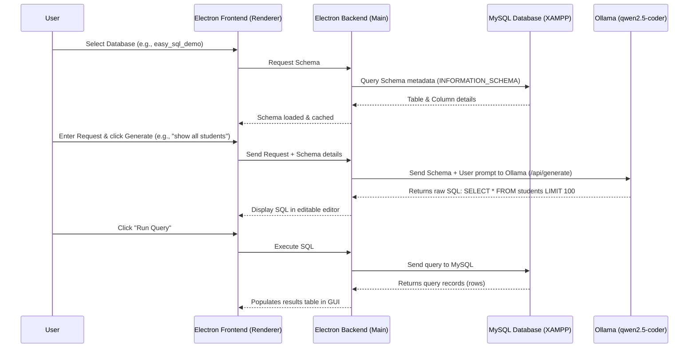

# Easy-SQL: Project Documentation & GenAI Architecture

This document provides a comprehensive overview of the **Easy-SQL** desktop application, its architecture, step-by-step workflow, and detailed explanations of its **Generative AI (GenAI)** integration.

---

## 1. Project Overview
**Easy-SQL** is a secure, cross-platform Electron desktop application designed to simplify database interaction. It allows non-technical users to query MySQL databases using plain English. The application uses a local LLM (Large Language Model) to translate natural language prompts into valid, optimized MySQL queries, executes them locally, and presents the output in an interactive results grid.

---

## 2. Technical Architecture
The system consists of three main decoupled layers:
1. **Frontend (Electron Renderer):** Built with HTML, CSS (featuring a modern glassmorphic dark theme), and vanilla JavaScript. It handles the user interface, configuration settings, query previews, and data rendering.
2. **Backend Services (Electron Main Process):** Node.js runtime that handles low-level operating system tasks. It manages:
   * Database connectivity (`mysql2/promise`).
   * REST requests to the local Ollama API.
   * Execution history and schema caching.
3. **AI Engine (Ollama):** A local service hosting open-source Large Language Models (LLMs) like `qwen2.5-coder:3b` or `codegemma:7b`. It runs completely offline on the user's host machine.

---

## 3. Generative AI Integration & Features

### A. How GenAI is Used (Mechanism)
Easy-SQL communicates with the local **Ollama API** via HTTP POST requests using the `/api/generate` endpoint. The process is fully local (100% offline), ensuring absolute data privacy.

When the user asks for data (e.g., *"show all students from BCA course"*), the application dynamically builds a **Contextual System Prompt** and sends it to the AI.

#### Dynamic Prompt Engineering Construction:
The prompt sent to the LLM is structured dynamically on the fly:
```text
System instruction:
You are an expert MySQL SQL generator. Generate valid MySQL SQL based only on the provided schema. Do not invent tables or columns. Return only SQL unless the user request is impossible or ambiguous.

Current selected database name: easy_sql_demo

Full schema summary:
Table: students
Columns:
  - id (int, PRI, auto_increment)
  - name (varchar(100))
  - age (int)
  - course (varchar(100))

User request:
show all students from BCA course

Generate one SQL statement that satisfies the request. Prefer safe and precise SQL. Use LIMIT 100 by default for SELECT queries unless the user asks otherwise.
```

### B. Core AI-Powered Features Implemented
1. **Natural Language to SQL Translation:** 
   Translates raw, unstructured human descriptions directly into structured, syntactically correct MySQL statements.
2. **Intelligent Query Classification:**
   The application analyzes the generated SQL to classify it into `READ_QUERY` (e.g., `SELECT`, `SHOW`) or `WRITE_OR_STRUCTURE_QUERY` (e.g., `INSERT`, `UPDATE`, `DROP`). Non-read queries trigger a safety confirmation popup before execution.
3. **Safety Guardrails (`LIMIT 100`):**
   The prompt system enforces a safety limit of `100` rows by default. This prevents heavy loads on the database engine and avoids application crashes due to massive memory consumption.
4. **Context-Aware SQL Generation (Schema Injection):**
   The AI doesn't just guess table names. It reads active database structures (columns, types, keys) and injects this schema metadata directly into its context, guaranteeing that the generated queries match the user's actual database schema.

---

## 4. End-to-End Workflow (How it Runs)



---

## 5. Summary of Key Strengths
* **Data Security:** MySQL credentials and query results are kept entirely in local system memory; nothing is shared over the cloud or sent to third-party web servers.
* **Editable Sandbox:** The generated SQL query is loaded into a fully editable Monaco-like text editor. Users can inspect, tweak, or fully rewrite the query before execution.
* **Modern Redesigned UI:** Designed with high-performance CSS styling, offering glassmorphic slate panels, custom dark scrollbars, glowing responsive borders, and unified layouts.
